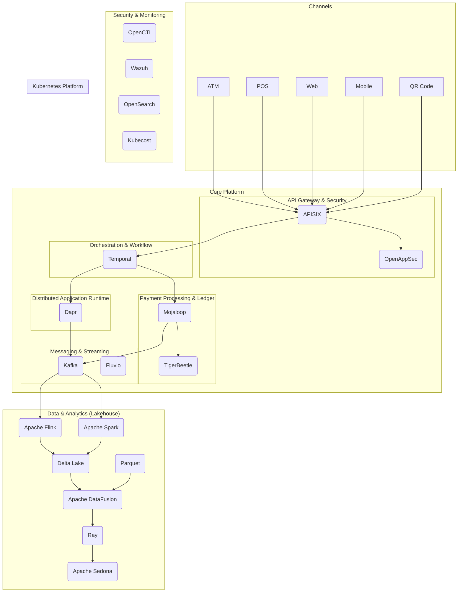

# Next Generation Payment Switch: System Architecture

## 1. Introduction

This document outlines the system architecture for the Next Generation Payment Switch, a robust, secure, and scalable platform for processing financial transactions. The architecture is designed to meet the demanding requirements of central banks, large financial institutions, and other financial service providers. It leverages a modern, cloud-native technology stack to provide a highly available, resilient, and extensible solution.

## 2. Architectural Principles

The architecture is guided by the following key principles:

- **Microservices-based:** The system is composed of small, independent services that can be developed, deployed, and scaled independently.
- **Event-driven:** Asynchronous, event-driven communication is used to decouple services and improve scalability and resilience.
- **Cloud-native:** The platform is designed to run on modern cloud infrastructure, leveraging containerization and orchestration technologies.
- **Secure by design:** Security is built into every layer of the architecture, from the infrastructure to the application code.
- **Open and extensible:** The use of open-source technologies and well-defined APIs makes the platform easy to extend and integrate with other systems.

## 3. Conceptual Architecture

The following diagram provides a high-level overview of the Next Generation Payment Switch architecture:

## 4. Component Breakdown

This section provides a more detailed description of each component in the architecture and its role in the system.

### 4.1. Channels

The platform supports a wide range of payment channels, including:

- **ATM:** Automated Teller Machines
- **POS:** Point of Sale terminals
- **Web:** E-commerce and online banking applications
- **Mobile:** Mobile banking and payment apps
- **QR Code:** QR code-based payments

### 4.2. API Gateway & Security

- **Apache APISIX:** Serves as the single entry point for all incoming API requests. It provides dynamic routing, load balancing, authentication, and other API management capabilities.
- **OpenAppSec:** A web application firewall (WAF) that provides an additional layer of security by protecting against common web application vulnerabilities.

### 4.3. Orchestration & Workflow

- **Temporal:** A durable execution platform used to orchestrate complex, multi-step payment workflows. Temporal ensures that workflows are executed reliably, even in the face of failures.

### 4.4. Payment Processing & Ledger

- **Mojaloop:** The core payment switching and interoperability framework. Mojaloop provides the rules and APIs for routing payments between different financial institutions.
- **TigerBeetle:** A high-performance, distributed financial ledger database. TigerBeetle is used to store all financial transactions in a secure and tamper-proof manner.

### 4.5. Messaging & Streaming

- **Apache Kafka:** A distributed event streaming platform used for asynchronous communication between microservices.
- **Fluvio:** A real-time data streaming platform that complements Kafka by providing a more lightweight and developer-friendly streaming experience.

### 4.6. Distributed Application Runtime

- **Dapr:** A portable, event-driven runtime that simplifies the development of microservices. Dapr provides a set of building blocks for common distributed system patterns, such as service-to-service invocation, state management, and pub/sub messaging.

### 4.7. Data & Analytics (Lakehouse)

The Lakehouse architecture provides a unified platform for both streaming and batch data processing, enabling advanced analytics and machine learning.

- **Delta Lake:** An open-source storage layer that brings ACID transactions to data lakes.
- **Parquet:** A columnar storage format that is optimized for analytics.
- **Apache Flink:** A stream processing framework for real-time data processing.
- **Apache Spark:** A unified analytics engine for large-scale data processing.
- **Apache DataFusion:** A query engine that provides a SQL interface to data in the Lakehouse.
- **Ray:** A distributed computing framework for scaling Python and machine learning applications.
- **Apache Sedona:** A cluster computing system for processing large-scale geospatial data.

### 4.8. Security & Monitoring

- **OpenCTI:** A cyber threat intelligence platform used to collect, analyze, and share information about cyber threats.
- **Wazuh:** A security monitoring and SIEM platform used to detect and respond to security threats in real time.
- **OpenSearch:** A distributed, open-source search and analytics engine used for log analytics and monitoring.
- **Kubecost:** A tool for monitoring and optimizing Kubernetes spending.

## 5. Data Flows

This section describes the flow of data through the system for a typical payment transaction.

1. A payment request is initiated from one of the channels (e.g., a mobile app).
2. The request is sent to the **APISIX** API gateway, which authenticates the request and routes it to the appropriate service.
3. A **Temporal** workflow is initiated to orchestrate the payment transaction.
4. The workflow interacts with **Mojaloop** to determine the route for the payment.
5. The payment is recorded in the **TigerBeetle** financial ledger.
6. Events related to the transaction are published to **Kafka**.
7. Other microservices, built with **Dapr**, can subscribe to these events to perform additional processing (e.g., sending notifications, updating balances).
8. The data is ingested into the **Lakehouse** for analytics and reporting.

## 6. Deployment Architecture

The entire platform is deployed on **Kubernetes**, a container orchestration platform that provides a scalable and resilient environment for running microservices. **Helm** charts are used to automate the deployment and configuration of the various components.

## 7. Next Steps

The next step is to create detailed technical documentation and diagrams for the architecture, including:

- API specifications
- Database schemas
- Deployment diagrams
- Sequence diagrams for key transaction flows
