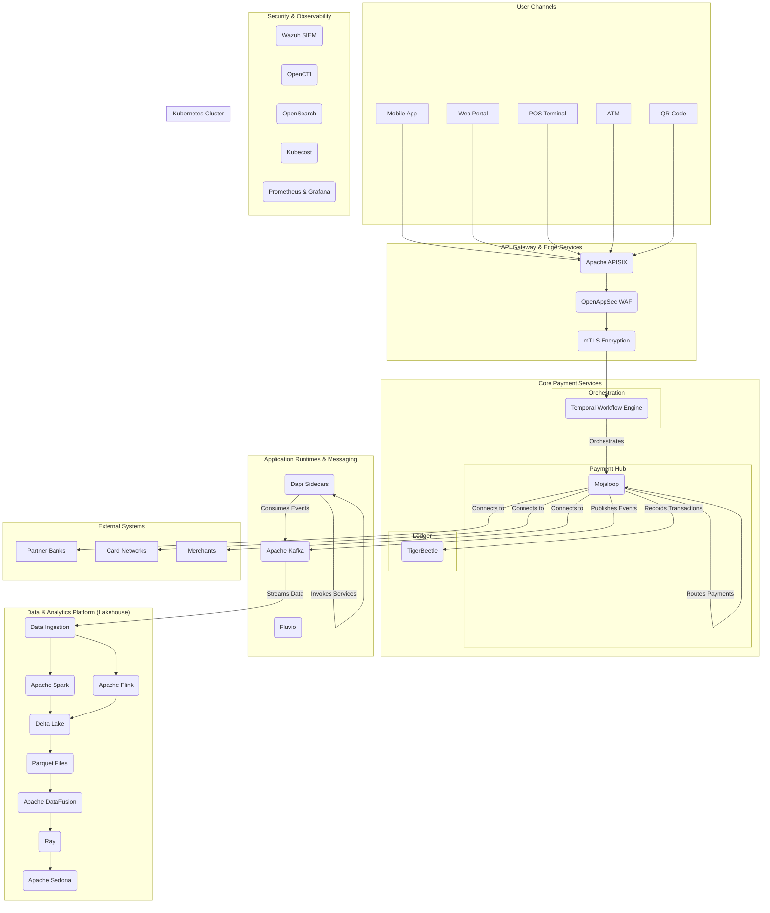

## Detailed Architecture Diagram

```mermaid
graph TD
    subgraph "User Channels"
        A[Mobile App]
        B[Web Portal]
        C[POS Terminal]
        D[ATM]
        E[QR Code]
    end

    subgraph "API Gateway & Edge Services"
        F(Apache APISIX)
        G(OpenAppSec WAF)
        H(mTLS Encryption)
    end

    subgraph "Core Payment Services"
        subgraph "Orchestration"
            I(Temporal Workflow Engine)
        end
        subgraph "Payment Hub"
            J(Mojaloop)
        end
        subgraph "Ledger"
            K(TigerBeetle)
        end
    end

    subgraph "Application Runtimes & Messaging"
        L(Dapr Sidecars)
        M(Apache Kafka)
        N(Fluvio)
    end

    subgraph "Data & Analytics Platform (Lakehouse)"
        O(Data Ingestion)
        P(Apache Spark)
        Q(Apache Flink)
        R(Delta Lake)
        S(Parquet Files)
        T(Apache DataFusion)
        U(Ray)
        V(Apache Sedona)
    end

    subgraph "Security & Observability"
        W(Wazuh SIEM)
        X(OpenCTI)
        Y(OpenSearch)
        Z(Kubecost)
        AA(Prometheus & Grafana)
    end

    subgraph "Kubernetes Cluster"
        F & G & H & I & J & K & L & M & N & O & P & Q & R & S & T & U & V & W & X & Y & Z & AA
    end

    A & B & C & D & E --> F
    F --> G
    G --> H
    H --> I

    I -- "Orchestrates" --> J
    J -- "Routes Payments" --> J
    J -- "Records Transactions" --> K
    J -- "Publishes Events" --> M

    L -- "Consumes Events" --> M
    L -- "Invokes Services" --> L

    M -- "Streams Data" --> O
    O --> P
    O --> Q
    P & Q --> R
    R --> S
    S --> T
    T --> U
    U --> V

    subgraph "External Systems"
        BB[Partner Banks]
        CC[Card Networks]
        DD[Merchants]
    end

    J -- "Connects to" --> BB
    J -- "Connects to" --> CC
    J -- "Connects to" --> DD
```
