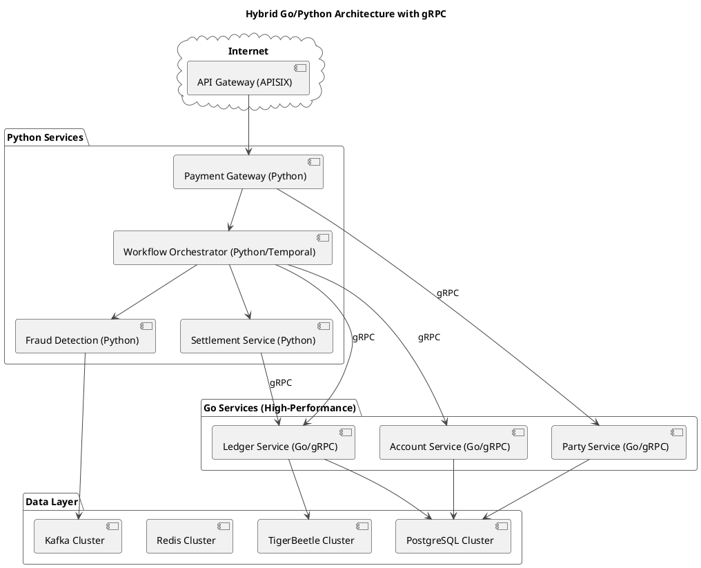

# Hybrid Go/Python Architecture with gRPC

This document outlines the hybrid Go/Python architecture for the Next Generation Payment Switch, designed for extreme performance and scalability. This architecture leverages Go for performance-critical services and Python for orchestration and business logic, with high-performance gRPC for inter-service communication.

## 1. Architecture Overview

The core principle of this architecture is to delegate high-throughput, low-latency operations to services written in Go, while retaining the flexibility and rapid development of Python for less performance-sensitive components. gRPC is used as the communication protocol between services, providing a high-performance, strongly-typed contract between them.

## 2. Service Responsibilities

### 2.1. Go Services (High-Performance Core)

*   **Ledger Service:** A high-performance gRPC service responsible for all interactions with the TigerBeetle ledger and the PostgreSQL transaction history. It will handle the creation of transfers, accounts, and the synchronization of transaction data.
*   **Account Service:** A gRPC service for managing account and balance information in the PostgreSQL database.
*   **Party Service:** A gRPC service for managing party information (account lookup) in the PostgreSQL database.

### 2.2. Python Services (Business Logic and Orchestration)

*   **Payment Gateway:** The main entry point for payment requests. It will be responsible for initial validation, authentication, and invoking the Temporal workflow. It will communicate with the Go services via gRPC for party lookups.
*   **Workflow Orchestrator (Temporal):** The core of the payment processing logic. The workflow will orchestrate the entire payment flow, calling the Go gRPC services for ledger, account, and party operations, and the Python services for fraud detection and settlement.
*   **Fraud Detection Service:** Remains in Python to leverage the rich ecosystem of machine learning and data analysis libraries.
*   **Settlement Service:** Remains in Python, as settlement is a less frequent, batch-oriented process.

## 3. Communication: gRPC

gRPC will be used for all synchronous communication between the Python and Go services. This offers several advantages:

*   **Performance:** gRPC is significantly faster than REST/JSON due to its use of HTTP/2 and Protocol Buffers.
*   **Strongly-Typed Contracts:** Protocol Buffers provide a clear, language-agnostic definition of services and messages, reducing integration errors.
*   **Streaming:** gRPC supports bidirectional streaming, which can be leveraged for more complex interaction patterns.

## 4. Implementation Plan

1.  **Define gRPC Services:** Create the `.proto` files that define the gRPC services and messages for the Ledger, Account, and Party services.
2.  **Implement Go Services:** Implement the gRPC servers in Go, including the TigerBeetle client and PostgreSQL database layer.
3.  **Generate Python Clients:** Generate the Python gRPC client stubs from the `.proto` files.
4.  **Integrate Python Services:** Update the Python services to use the generated gRPC clients to communicate with the Go services.
