# Optimized Architecture for 20 Billion Transactions/Month

This document outlines the optimized architecture for the Next Generation Payment Switch, designed to handle 20 billion transactions per month with high availability and performance. This design incorporates a multi-region, active-active deployment, a dual-ledger system with TigerBeetle and PostgreSQL, and a comprehensive integration strategy using a service mesh.

## 1. High-Level Architecture

The optimized architecture is based on a multi-region, active-active deployment model to ensure high availability and low latency for a global user base. The following diagram illustrates the high-level architecture:

```plantuml
@startuml
!theme vibrant

title Optimized Architecture for 20B Transactions/Month

cloud "Internet" {
  [Global Load Balancer] as GLB
}

package "Region 1 (Active)" {
  [Regional Load Balancer 1] as RLB1
  [API Gateway (APISIX) 1] as APIGW1
  [Service Mesh (Istio) 1] as SM1

  package "Kubernetes Cluster 1" {
    package "Payment Services 1" {
      [Payment Gateway 1]
      [Workflow Orchestrator 1]
      [Fraud Detection 1]
      [Settlement Service 1]
    }

    package "Core Infrastructure 1" {
      [Mojaloop 1]
      [Temporal 1]
      [Kafka Cluster 1]
    }

    package "Data Layer 1" {
      [TigerBeetle Cluster 1]
      [PostgreSQL Cluster 1]
      [Redis Cluster 1]
    }
  }
}

package "Region 2 (Active)" {
  [Regional Load Balancer 2] as RLB2
  [API Gateway (APISIX) 2] as APIGW2
  [Service Mesh (Istio) 2] as SM2

  package "Kubernetes Cluster 2" {
    package "Payment Services 2" {
      [Payment Gateway 2]
      [Workflow Orchestrator 2]
      [Fraud Detection 2]
      [Settlement Service 2]
    }

    package "Core Infrastructure 2" {
      [Mojaloop 2]
      [Temporal 2]
      [Kafka Cluster 2]
    }

    package "Data Layer 2" {
      [TigerBeetle Cluster 2]
      [PostgreSQL Cluster 2]
      [Redis Cluster 2]
    }
  }
}

package "Region 3 (Active)" {
  [Regional Load Balancer 3] as RLB3
  [API Gateway (APISIX) 3] as APIGW3
  [Service Mesh (Istio) 3] as SM3

  package "Kubernetes Cluster 3" {
    package "Payment Services 3" {
      [Payment Gateway 3]
      [Workflow Orchestrator 3]
      [Fraud Detection 3]
      [Settlement Service 3]
    }

    package "Core Infrastructure 3" {
      [Mojaloop 3]
      [Temporal 3]
      [Kafka Cluster 3]
    }

    package "Data Layer 3" {
      [TigerBeetle Cluster 3]
      [PostgreSQL Cluster 3]
      [Redis Cluster 3]
    }
  }
}

GLB --> RLB1
GLB --> RLB2
GLB --> RLB3

RLB1 --> APIGW1
RLB2 --> APIGW2
RLB3 --> APIGW3

APIGW1 --> SM1
APIGW2 --> SM2
APIGW3 --> SM3

SM1 --> [Payment Gateway 1]
SM1 --> [Workflow Orchestrator 1]
SM1 --> [Fraud Detection 1]
SM1 --> [Settlement Service 1]

SM2 --> [Payment Gateway 2]
SM2 --> [Workflow Orchestrator 2]
SM2 --> [Fraud Detection 2]
SM2 --> [Settlement Service 2]

SM3 --> [Payment Gateway 3]
SM3 --> [Workflow Orchestrator 3]
SM3 --> [Fraud Detection 3]
SM3 --> [Settlement Service 3]

[Payment Gateway 1] --> [Mojaloop 1]
[Payment Gateway 1] --> [Temporal 1]
[Payment Gateway 1] --> [Kafka Cluster 1]

[Workflow Orchestrator 1] --> [Mojaloop 1]
[Workflow Orchestrator 1] --> [TigerBeetle Cluster 1]
[Workflow Orchestrator 1] --> [PostgreSQL Cluster 1]

[Settlement Service 1] --> [Mojaloop 1]
[Settlement Service 1] --> [TigerBeetle Cluster 1]
[Settlement Service 1] --> [PostgreSQL Cluster 1]

[Mojaloop 1] --> [PostgreSQL Cluster 1]

[TigerBeetle Cluster 1] <--> [TigerBeetle Cluster 2] : Replication
[TigerBeetle Cluster 1] <--> [TigerBeetle Cluster 3] : Replication
[PostgreSQL Cluster 1] <--> [PostgreSQL Cluster 2] : Replication
[PostgreSQL Cluster 1] <--> [PostgreSQL Cluster 3] : Replication
[Kafka Cluster 1] <--> [Kafka Cluster 2] : Mirroring
[Kafka Cluster 1] <--> [Kafka Cluster 3] : Mirroring
[Redis Cluster 1] <--> [Redis Cluster 2] : Replication
[Redis Cluster 1] <--> [Redis Cluster 3] : Replication

@enduml
```

## 2. Component-Level Design for Performance and HA

### 2.1. API Gateway (Apache APISIX)
- **Performance**: Deployed as a daemon set on dedicated nodes for low latency. Caching of frequently accessed, non-sensitive data is enabled.
- **HA**: 3+ replicas per region. Health checks and automatic failover are configured.

### 2.2. Service Mesh (Istio)
- **Performance**: Optimized for low-latency communication between services. Uses Envoy proxies for high-performance data plane.
- **HA**: Istio control plane is deployed in a highly available configuration with 3+ replicas.

### 2.3. Payment Services (Gateway, Workflow, Fraud, Settlement)
- **Performance**: Services are stateless and horizontally scalable. Connection pooling is used for all database interactions.
- **HA**: 3+ replicas per service per region. Kubernetes Horizontal Pod Autoscaler (HPA) is used to automatically scale based on CPU and memory usage.

### 2.4. Core Infrastructure (Mojaloop, Temporal, Kafka)
- **Mojaloop**: Optimized for PostgreSQL with connection pooling. Read replicas are used for non-critical queries.
- **Temporal**: Worker processes are scaled horizontally to handle high workflow volumes. Activity batching is used to reduce overhead.
- **Kafka**: Topics are configured with 100+ partitions for high throughput. Producers use batching and compression (LZ4/Snappy).

## 3. Data Architecture: Dual Ledger with TigerBeetle and PostgreSQL

### 3.1. TigerBeetle (Primary Ledger)
- **Purpose**: Real-time, high-performance ledger for core transaction processing, balance management, and double-entry accounting.
- **Performance**: Deployed in a clustered configuration with 10+ clusters, each handling 2 billion transactions per month. Batch operations are used for creating transfers.
- **HA**: Each cluster has a 3-way replication factor. Data is replicated across all three regions.

### 3.2. PostgreSQL (Secondary Ledger and Application Database)
- **Purpose**: Serves as the primary database for Mojaloop, storing transaction history, analytics data, audit trails, and other application data.
- **Performance**: Deployed as a highly available cluster with a primary and multiple read replicas. Connection pooling (PgBouncer) is used to manage connections efficiently. Tables are partitioned by date and region to manage large data volumes.
- **HA**: Streaming replication is used to keep read replicas in sync with the primary. Automatic failover is configured to promote a replica in case of primary failure.

## 4. Scalability Strategy for 20 Billion Transactions/Month

| Component | Scalability Strategy |
|---|---|
| **Payment Gateway** | Horizontal scaling to 50+ replicas per region. |
| **Fraud Detection** | Horizontal scaling to 30+ replicas per region. |
| **Workflow Orchestrator** | Horizontal scaling to 20+ replicas per region. |
| **Settlement Service** | Horizontal scaling to 10+ replicas per region. |
| **TigerBeetle** | 10+ clusters, each handling 2 billion transactions/month. |
| **PostgreSQL** | Horizontal partitioning by date/region. Read replicas for analytics. |
| **Kafka** | 100+ partitions per topic, 10+ brokers per region. |
| **Redis** | Redis Cluster with 10+ nodes per region. |

## 5. High Availability and Disaster Recovery

### 5.1. Multi-Region Active-Active Deployment
- The platform is deployed across three geographically distributed regions in an active-active configuration. This ensures that if one region becomes unavailable, traffic is automatically routed to the other healthy regions.

### 5.2. Data Replication
- **TigerBeetle**: Data is replicated across all three regions in near real-time.
- **PostgreSQL**: Streaming replication is used to replicate data to all regions.
- **Kafka**: Kafka MirrorMaker 2 is used to mirror topics across regions.
- **Redis**: Cross-region replication is enabled for Redis Enterprise.

### 5.3. Disaster Recovery
- **Recovery Point Objective (RPO)**: < 1 minute
- **Recovery Time Objective (RTO)**: < 5 minutes
- **Backup Strategy**: Continuous backups of PostgreSQL and TigerBeetle data are stored in a separate, isolated region.
- **DR Drills**: Monthly disaster recovery drills are conducted to ensure the recovery process is reliable and meets the RPO/RTO targets.

## 6. Integration Layer: Service Mesh (Istio)

A service mesh (Istio) is introduced to provide a dedicated infrastructure layer for making service-to-service communication safe, fast, and reliable. Key features include:

- **Intelligent Routing and Load Balancing**: Advanced traffic management capabilities, including canary deployments, A/B testing, and fine-grained traffic shifting.
- **Resilience**: Automatic retries, circuit breakers, and timeouts to prevent cascading failures.
- **Observability**: Detailed metrics, logs, and traces for every service, providing deep insights into application performance and behavior.
- **Security**: Secure service-to-service communication with mTLS encryption, authentication, and authorization policies.
