# OG-RMM Platform v12.0 — Middleware Architecture

**Author:** Manus AI  
**Version:** 12.0  
**Date:** March 2026

---

## Overview

The OG-RMM (Oil & Gas Remote Monitoring & Management) Platform v12.0 introduces a production-grade middleware stack that connects field equipment, edge computing nodes, and cloud analytics into a unified operational technology (OT) / information technology (IT) convergence platform. The architecture is designed for GCC (Gulf Cooperation Council) upstream and midstream operators, addressing the specific regulatory, environmental, and operational requirements of the region.

The v12.0 stack replaces ad-hoc point-to-point integrations with a structured, observable, and resilient middleware layer composed of eleven purpose-built services, each implemented in the language best suited to its workload: **Go** for high-throughput I/O and workflow orchestration, **Python** for data engineering and analytics, and **TypeScript/Node.js** for the API gateway and frontend.

---

## Architecture Diagram

```mermaid
graph TB
    subgraph "Field Layer"
        OPC[OPC-UA Servers<br/>Wellhead / SCADA]
        MODBUS[Modbus RTU/TCP<br/>PLCs & RTUs]
        HART[HART Instruments<br/>Pressure / Temp / Flow]
    end

    subgraph "Edge Layer"
        FLUVIO[Fluvio Edge Broker<br/>Go SDK]
        DAPR_EDGE[Dapr Sidecar<br/>Edge Node]
    end

    subgraph "Streaming Layer"
        KAFKA[Apache Kafka<br/>Confluent / MSK]
        FLUVIO_CLOUD[Fluvio Cloud<br/>High-throughput ingest]
    end

    subgraph "Go Middleware Worker"
        GO_MAIN[main.go<br/>Service orchestrator]
        GO_KAFKA[kafka/producer.go<br/>kafka/consumer.go]
        GO_REDIS[cache/client.go<br/>ioredis wrapper]
        GO_TB[ledger/client.go<br/>TigerBeetle client]
        GO_TEMPORAL[temporal/worker.go<br/>PTW + OTA + Regulatory]
        GO_AUTHZ[authz/permify.go<br/>gRPC client]
        GO_API[api/server.go<br/>HTTP :8090]
    end

    subgraph "Python RTDIP Service"
        PY_API[rtdip_api.py<br/>FastAPI :8000]
        PY_OPCUA[OPC-UA Simulator<br/>asyncua]
        PY_SPARK[PySpark + Delta Lake<br/>RTDIP SDK]
        PY_MINIO[MinIO / S3<br/>Delta table storage]
    end

    subgraph "Security Layer"
        KEYCLOAK[Keycloak<br/>OIDC / SAML IdP]
        PERMIFY[Permify<br/>RBAC / ABAC engine]
        APISIX[Apache APISIX<br/>API Gateway]
    end

    subgraph "State & Cache"
        REDIS[Redis 7<br/>Cache + Pub/Sub]
        TIGERBEETLE[TigerBeetle<br/>Double-entry ledger]
    end

    subgraph "Workflow Engine"
        TEMPORAL[Temporal Server<br/>Workflow orchestration]
        TEMPORAL_WORKER[Temporal Worker<br/>Go SDK]
    end

    subgraph "Demand Response"
        OPENLEADR[OpenLEADR VTN<br/>OpenADR 3.1]
        VEN[VEN Nodes<br/>Field equipment]
    end

    subgraph "Node.js API Server"
        TRPC[tRPC Router<br/>Express + Superjson]
        DB[(PostgreSQL<br/>Drizzle ORM)]
        CACHE_ROUTER[cache router]
        STREAMING_ROUTER[streaming router]
        LEDGER_ROUTER[ledger router]
        WORKFLOWS_ROUTER[workflows router]
        LAKEHOUSE_ROUTER[lakehouse router]
        DR_ROUTER[demandResponse router]
        AUTHZ_ROUTER[authz router]
    end

    subgraph "React Frontend"
        OVERVIEW[Overview Dashboard]
        WELLS[Wells & Telemetry]
        INFRA[Infrastructure Page]
        LAKEHOUSE_UI[Delta Lakehouse Page]
        DR_UI[Demand Response Page]
        TEMPORAL_UI[Temporal Workflows Page]
    end

    OPC --> FLUVIO
    MODBUS --> FLUVIO
    HART --> FLUVIO
    FLUVIO --> KAFKA
    DAPR_EDGE --> KAFKA

    KAFKA --> GO_KAFKA
    GO_KAFKA --> GO_REDIS
    GO_KAFKA --> GO_TB
    GO_MAIN --> GO_TEMPORAL
    GO_MAIN --> GO_AUTHZ
    GO_MAIN --> GO_API

    OPC --> PY_OPCUA
    PY_OPCUA --> PY_SPARK
    PY_SPARK --> PY_MINIO

    APISIX --> TRPC
    APISIX --> PY_API
    APISIX --> GO_API

    KEYCLOAK --> APISIX
    PERMIFY --> GO_AUTHZ

    GO_REDIS --> REDIS
    GO_TB --> TIGERBEETLE
    GO_TEMPORAL --> TEMPORAL
    TEMPORAL --> TEMPORAL_WORKER

    OPENLEADR --> VEN

    TRPC --> DB
    TRPC --> CACHE_ROUTER
    TRPC --> STREAMING_ROUTER
    TRPC --> LEDGER_ROUTER
    TRPC --> WORKFLOWS_ROUTER
    TRPC --> LAKEHOUSE_ROUTER
    TRPC --> DR_ROUTER
    TRPC --> AUTHZ_ROUTER

    CACHE_ROUTER --> GO_API
    STREAMING_ROUTER --> GO_API
    LEDGER_ROUTER --> GO_API
    WORKFLOWS_ROUTER --> GO_API
    LAKEHOUSE_ROUTER --> PY_API
    DR_ROUTER --> OPENLEADR
    AUTHZ_ROUTER --> GO_API

    INFRA --> TRPC
    LAKEHOUSE_UI --> TRPC
    DR_UI --> TRPC
    TEMPORAL_UI --> TRPC
    OVERVIEW --> TRPC
    WELLS --> TRPC
```



---

## Service Inventory

| Service | Language | Port | Role | Fallback |
|---|---|---|---|---|
| Apache Kafka | JVM | 9092 | Event streaming backbone | Simulation mode |
| Fluvio | Rust | 9003 | Edge streaming / SCADA ingest | Kafka passthrough |
| Redis 7 | C | 6379 | Cache, pub/sub, session | In-memory simulation |
| TigerBeetle | Zig | 3001 | Double-entry production ledger | In-memory simulation |
| Temporal Server | Go | 7233 | Durable workflow engine | Simulation mode |
| Permify | Go | 3476 (gRPC) | RBAC/ABAC authorization | Role-based simulation |
| Keycloak | Java | 8080 | OIDC/SAML identity provider | Manus OAuth |
| Apache APISIX | Lua/Nginx | 9080 | API gateway, rate limiting | Direct routing |
| Dapr Runtime | Go | 3500 | Distributed app runtime | Direct calls |
| RTDIP / PySpark | Python | 8000 | Time-series analytics | OPC-UA simulator |
| MinIO | Go | 9000 | S3-compatible Delta Lake store | Local filesystem |
| OpenLEADR VTN | Rust | 8080 | OpenADR 3.1 demand response | Simulated programs |

---

## Go Middleware Worker

The Go worker (`middleware/go/`) is the central integration hub, implemented as a single binary that starts multiple goroutines:

### Kafka Producer/Consumer

```go
// internal/kafka/producer.go
// Publishes sensor readings to og.telemetry.raw
// Publishes alarm events to og.alarms.events
// Publishes OTA status to og.ota.status
```

The producer uses the `segmentio/kafka-go` library with automatic retry and dead-letter queue (DLQ) support. The consumer group `og-rmm-worker` processes telemetry, enriches with well metadata from PostgreSQL, and forwards to Redis for real-time caching.

### TigerBeetle Ledger

The ledger client implements a double-entry accounting model for production volumes:

- **Debit accounts:** per-well production (oil, gas, water)
- **Credit accounts:** field-level allocation targets
- **Transfer types:** `PRODUCTION_VOLUME`, `ALLOCATION_CREDIT`, `ROYALTY_DEBIT`

Each transfer is immutable and cryptographically linked, providing an audit trail that satisfies Saudi Aramco MFMS and ADNOC DIMS reporting requirements.

### Temporal Workflows

Three workflow types are registered:

**PTWWorkflow** (Permit-to-Work)
```
DRAFT → PENDING_APPROVAL → APPROVED → ACTIVE → CLOSED
                         ↓
                      REJECTED
```
Signals: `ptw.approve`, `ptw.reject`, `ptw.close`, `ptw.suspend`

**OTACampaignWorkflow** (Over-the-Air firmware updates)
```
CREATED → VALIDATING → DEPLOYING → VERIFYING → COMPLETED
                                 ↓
                              FAILED → ROLLBACK
```
Signals: `ota.pause`, `ota.resume`, `ota.cancel`

**RegulatorySubmissionWorkflow** (MWAN / ADNOC / SEC compliance)
```
DRAFT → SUBMITTED → UNDER_REVIEW → APPROVED → FILED
                                 ↓
                              REJECTED → REVISION
```
Signals: `regulatory.submit`, `regulatory.callback`, `regulatory.withdraw`

### Permify Authorization

The Permify schema models well-level and field-level access:

```
entity user {}

entity well {
  relation owner @user
  relation operator @user
  relation viewer @user

  action read   = owner or operator or viewer
  action write  = owner or operator
  action admin  = owner
  action start_ptw = operator
}

entity field {
  relation manager @user
  relation engineer @user

  action read   = manager or engineer
  action write  = manager
  action approve_ptw = manager
}
```

---

## Python RTDIP Service

The Python service (`middleware/python/rtdip_api.py`) provides:

### OPC-UA Simulator

When `OPC_UA_SERVER_URL` is not configured, the service generates realistic synthetic telemetry using sinusoidal models with configurable noise:

```python
# Wellhead pressure: 1200–1800 psi (sinusoidal + noise)
# Tubing temperature: 150–200 °F
# Gas rate: 800–1200 mscf/d
# Oil rate: 300–500 bbl/d
```

### Delta Lake Writer

When PySpark is available, the service writes time-series data to Delta Lake tables following the RTDIP PCDM (Process Control Data Model):

```
s3a://og-rmm-lakehouse/pcdm/
  ├── raw/           # Raw OPC-UA values
  ├── business/      # Cleaned, unit-converted values
  └── twa/           # Time-weighted averages (hourly/daily)
```

### Query API

| Endpoint | Method | Description |
|---|---|---|
| `GET /health` | GET | Service health check |
| `GET /tags` | GET | Tag discovery with search |
| `GET /latest` | GET | Latest values for tag list |
| `POST /resample` | POST | Resampled time-series data |
| `POST /twa` | POST | Time-weighted average calculation |
| `POST /ingest` | POST | Ingest OPC-UA batch |

---

## tRPC Router Layer

Seven new routers were added to `server/routers.ts`:

| Router | Procedures | Backend |
|---|---|---|
| `cache` | `getStats`, `invalidate` | Redis via Go worker |
| `streaming` | `getKafkaStats`, `getTopics`, `getWorkerStatus`, `publishSensorReading` | Kafka via Go worker |
| `ledger` | `getWellLedger`, `getFieldLedger`, `recordProduction`, `getTransactions` | TigerBeetle via Go worker |
| `workflows` | `list`, `start`, `signal`, `terminate`, `getStatus` | Temporal via Go worker |
| `lakehouse` | `getStatus`, `getTags`, `getLatest`, `queryResample`, `queryTWA` | Python RTDIP service |
| `demandResponse` | `getStatus`, `getPrograms`, `getEvents`, `getVens`, `createEvent`, `cancelEvent` | OpenLEADR VTN |
| `authz` | `check`, `bulkCheck`, `writeRelationship`, `getStatus` | Permify via Go worker |

All routers implement graceful degradation: when the backing service is unavailable, they return simulated data with a `source: "simulated"` flag so the UI can display an appropriate indicator.

---

## Frontend Pages

Three new pages were added to the React frontend:

### Infrastructure Dashboard (`/infrastructure`)

Displays real-time health status for all 12 middleware services, organized by category (Streaming, Cache, Ledger, Workflow, Security, Analytics, Energy, Gateway, Runtime, Storage). Each service card shows:
- Online / Simulated / Unavailable status
- Expandable detail panel with configuration metadata
- Kafka topic table with partition and retention information

### Delta Lakehouse (`/lakehouse`)

Provides time-series analytics interface:
- **Tag Browser:** OPC-UA tag discovery with well filter and search
- **TWA Panel:** 24-hour time-weighted average for regulatory compliance
- **Trend Chart:** 24-hour resampled trend (1-hour intervals) via Recharts
- **Live Values:** Real-time tag values refreshed every 5 seconds

### Demand Response (`/demand-response`)

OpenADR 3.1 management interface:
- **Program cards:** DR program listing with country/subdivision metadata
- **Event management:** Create and cancel demand-response events with load reduction slider
- **VEN registry:** Registered field equipment nodes

---

## Deployment

### Docker Compose

The complete stack is defined in `docker-compose.yml` at the project root. Services are organized into profiles:

```bash
# Start core infrastructure
docker compose --profile core up -d

# Start with analytics
docker compose --profile core --profile analytics up -d

# Start full stack
docker compose --profile core --profile analytics --profile security up -d
```

### Environment Variables

| Variable | Service | Description |
|---|---|---|
| `KAFKA_BROKERS` | Go worker | Comma-separated broker list |
| `REDIS_URL` | Node.js + Go | Redis connection URL |
| `TEMPORAL_ADDRESS` | Go worker | Temporal frontend address |
| `PERMIFY_ENDPOINT` | Go worker | Permify gRPC endpoint |
| `RTDIP_API_URL` | Node.js | Python RTDIP service URL |
| `OPENLEADR_VTN_URL` | Node.js | OpenLEADR VTN base URL |
| `GO_WORKER_URL` | Node.js | Go worker HTTP API URL |
| `TIGERBEETLE_ADDRESS` | Go worker | TigerBeetle cluster address |
| `MINIO_ENDPOINT` | Python | MinIO S3 endpoint |
| `OPC_UA_SERVER_URL` | Python | OPC-UA server endpoint |

---

## Security Considerations

The v12.0 architecture applies defense-in-depth across all layers:

**Network layer:** APISIX enforces JWT authentication on all `/api/trpc` routes, rate-limits unauthenticated requests to 100 req/min, and strips internal headers before forwarding to upstream services.

**Identity layer:** Keycloak federates with Active Directory (LDAP) for enterprise SSO, issues short-lived JWTs (15-minute TTL), and enforces MFA for all privileged operations (PTW approval, OTA deployment, regulatory submission).

**Authorization layer:** Permify enforces fine-grained RBAC/ABAC at the well and field level. The `adminProcedure` pattern in tRPC ensures server-side enforcement independent of frontend state.

**Data layer:** All Delta Lake tables are encrypted at rest (AES-256) in MinIO. TigerBeetle provides cryptographic integrity for all ledger entries. Redis is configured with `requirepass` and TLS in production.

**Audit layer:** All workflow state transitions are logged to the PostgreSQL `audit_log` table with user ID, timestamp, and action. Temporal's event history provides an immutable record of all workflow executions.

---

## References

- [Temporal Go SDK Documentation](https://docs.temporal.io/dev-guide/go)
- [Permify Authorization Model](https://docs.permify.co/getting-started/modeling)
- [RTDIP SDK Documentation](https://www.rtdip.io/sdk/code-reference/query/functions/)
- [OpenLEADR OpenADR 3.1 Specification](https://www.openadr.org/specification)
- [Apache Kafka Documentation](https://kafka.apache.org/documentation/)
- [TigerBeetle Financial Accounting](https://docs.tigerbeetle.com/)
- [Fluvio Streaming Platform](https://www.fluvio.io/docs/)
- [Apache APISIX Gateway](https://apisix.apache.org/docs/)
- [Dapr Distributed Runtime](https://docs.dapr.io/)
- [Delta Lake Protocol](https://github.com/delta-io/delta/blob/master/PROTOCOL.md)
