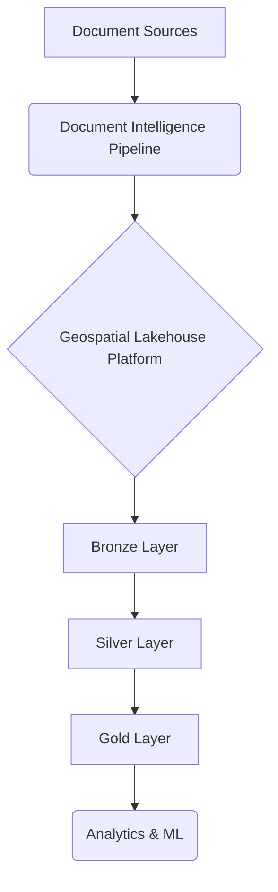
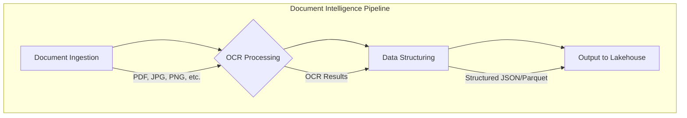
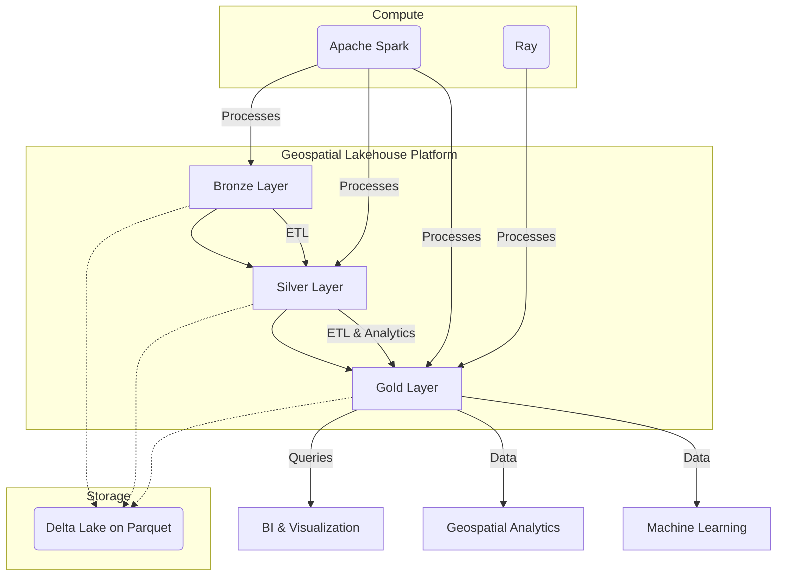

# System Architecture: Document Intelligence and Geospatial Lakehouse

## 1. Introduction

This document outlines the system architecture for a comprehensive data platform that combines document intelligence with a geospatial Lakehouse. The platform is designed to analyze a wide range of documents at scale using DeepSeek-OCR and to provide advanced geospatial analytics capabilities through a Lakehouse architecture built on Delta Lake, Apache Spark, and Ray.

## 2. Overall Architecture

The system is composed of two main interconnected subsystems: the **Document Intelligence Pipeline** and the **Geospatial Lakehouse Platform**. The overall workflow is as follows:

1.  Documents are ingested into the Document Intelligence Pipeline.
2.  The pipeline uses DeepSeek-OCR to extract text, structure, and other relevant information from the documents.
3.  The extracted data is then loaded into the Bronze layer of the Geospatial Lakehouse.
4.  The data is processed and refined through the Silver and Gold layers of the Lakehouse.
5.  The Gold layer provides analytics-ready data for various applications, including geospatial analysis, business intelligence, and machine learning.

## 3. Document Intelligence Pipeline

The Document Intelligence Pipeline is responsible for ingesting and processing documents to extract valuable information. It is designed for scalability and accuracy, leveraging the DeepSeek-OCR model.

### 3.1. Architecture

### 3.2. Components

*   **Document Ingestion**: This component is responsible for receiving documents from various sources, such as file uploads, email attachments, or cloud storage. It will handle different file formats, including PDF, JPG, PNG, and TIFF.

*   **OCR Processing**: This is the core of the pipeline, where DeepSeek-OCR is used to perform optical character recognition. We will use the vLLM inference engine for high-throughput, concurrent processing of documents. This allows for efficient scaling to handle large volumes of documents. The processing will be configured to handle the various document types identified in the initial analysis, including forms, letters, and ID cards.

*   **Data Structuring**: The raw OCR output is processed to extract structured information. This includes identifying key-value pairs, tables, and other relevant data fields. The output will be a structured format, such as JSON or Parquet, which is then loaded into the Lakehouse.

*   **Output to Lakehouse**: The structured data is written to the Bronze layer of the Geospatial Lakehouse, ready for further processing.

## 4. Geospatial Lakehouse Platform

The Geospatial Lakehouse Platform is built on a multi-hop architecture (Bronze, Silver, Gold) and leverages a modern data stack to provide a scalable and performant solution for data storage, processing, and analytics.

### 4.1. Architecture

### 4.2. Components

*   **Storage Layer**: The foundation of the Lakehouse is **Delta Lake** built on top of **Apache Parquet** files. This provides ACID transactions, data versioning (time travel), and performance optimizations such as Z-ordering and data skipping. This is particularly beneficial for geospatial data, where we can use Z-ordering on geohashes or other spatial indices to significantly speed up queries.

*   **Compute Layer**: The compute layer is composed of **Apache Spark** and **Ray**.
    *   **Apache Spark** is the primary engine for large-scale ETL (Extract, Transform, Load) jobs, moving data between the Bronze, Silver, and Gold layers. Spark SQL will be used for structured data queries.
    *   **Ray** is used for distributed machine learning and other parallel processing tasks. While the `datafusion-ray` project is not maintained, we can still leverage Ray for distributed computing by reading data from the Gold layer of the Lakehouse into Ray Datasets for ML model training and other computationally intensive tasks.

*   **Multi-Hop Data Layers**:
    *   **Bronze Layer**: This layer stores the raw, unstructured or semi-structured data from the Document Intelligence Pipeline. The data is stored in its original format as much as possible, with minimal transformations.
    *   **Silver Layer**: The data from the Bronze layer is cleaned, validated, and structured in the Silver layer. This is where data quality checks are performed, and the data is enriched with additional information, such as geocoding addresses to get latitude and longitude.
    *   **Gold Layer**: The Gold layer contains the most refined, aggregated, and analytics-ready data. This data is optimized for specific business use cases, such as geospatial analysis, business intelligence reporting, and machine learning. Datasets in the Gold layer are often denormalized and aggregated to provide fast query performance.

### 4.3. Geospatial Capabilities

The platform will have strong geospatial capabilities, including:

*   **Geospatial Indexing**: Using techniques like geohashing and H3 to index spatial data for fast querying.
*   **Spatial Queries**: Supporting a wide range of spatial queries, such as point-in-polygon, distance calculations, and spatial joins.
*   **Geospatial Libraries**: Using libraries like GeoPandas, Shapely, and potentially Sedona or GeoMesa with Spark to perform advanced geospatial analysis.

## 5. Conclusion

This architecture provides a robust and scalable solution for both document intelligence and advanced geospatial analytics. By combining the power of DeepSeek-OCR with a modern Lakehouse architecture, we can unlock valuable insights from a wide range of documents and enable data-driven decision-making.
