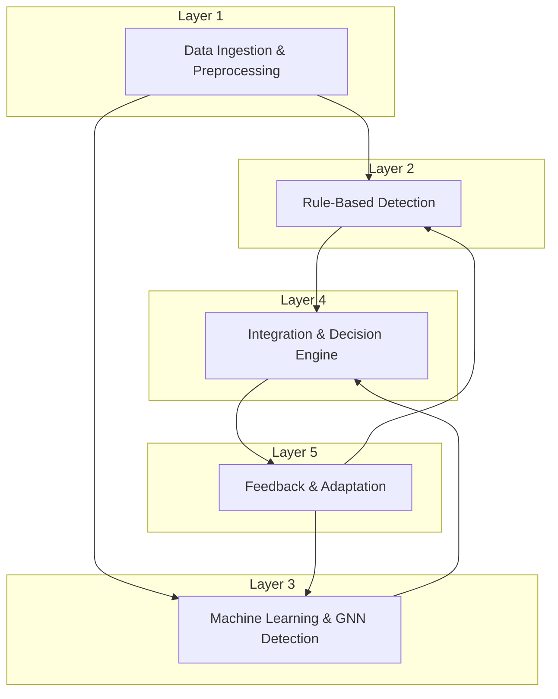

# State-of-the-Art AI Fraud Detection Architecture

## 1. Introduction

This document outlines a state-of-the-art, hybrid AI fraud detection architecture for the Next-Generation Payment Switch. The proposed architecture combines rule-based systems with advanced machine learning (ML), deep learning (DL), and Graph Neural Network (GNN) models to achieve high accuracy, low latency, and adaptability to emerging fraud patterns. This design is based on extensive research into the latest academic and industry best practices [1, 2, 3].

## 2. Architectural Principles

The architecture is guided by the following principles:

*   **Hybrid Approach**: Leverage the strengths of both rule-based systems (explainability, domain knowledge) and AI models (pattern recognition, adaptability).
*   **Real-Time Processing**: Ensure sub-second latency for fraud scoring to enable real-time transaction blocking.
*   **Scalability**: Handle billions of transactions per month through a distributed and scalable infrastructure.
*   **Explainability (XAI)**: Provide clear explanations for fraud decisions to meet regulatory requirements and aid investigators.
*   **Continuous Learning**: Automatically adapt to new fraud patterns through a robust feedback and retraining loop.
*   **Multi-Tenancy**: Support multiple tenants (banks, financial institutions) with tenant-specific models and data isolation.

## 3. Five-Layer Hybrid Architecture

We propose a five-layer architecture for the fraud detection platform, as illustrated in the diagram below.

### 3.1. Layer 1: Data Ingestion and Preprocessing

This layer is responsible for ingesting real-time transaction data and preparing it for the detection engines.

*   **Data Ingestion**: Real-time transaction data from the POS Gateway, core banking systems, and other sources will be ingested via **Apache Kafka** and **Fluvio** for high-throughput, low-latency streaming.
*   **Feature Engineering**: **Apache Spark** and **Apache Flink** will be used for real-time feature engineering, creating both traditional features (e.g., transaction velocity, amount deviation) and graph-based features (e.g., node centrality, community detection).
*   **Graph Construction**: A real-time transaction graph will be constructed and maintained in a distributed graph database (e.g., Neo4j, TigerGraph). This graph will model relationships between users, merchants, devices, and accounts.

### 3.2. Layer 2: Rule-Based Detection

This layer provides the first line of defense using a highly explainable rule-based system.

*   **Rule Engine**: We will use a combination of **Drools** for complex rule sets and **PyKnow** for simpler, more dynamic rules. This allows for both high-performance and flexible rule management.
*   **Rule Categories**: The rules will cover:
    *   **Velocity Checks**: Limits on transaction frequency and amount.
    *   **Thresholds**: Hard limits on transaction values.
    *   **Blacklists/Whitelists**: Blocking or allowing transactions based on known fraudulent or trusted entities.
    *   **Regulatory Compliance**: Rules to enforce AML/CFT and other regulatory requirements.

### 3.3. Layer 3: Machine Learning and GNN Detection

This layer employs a suite of advanced AI models to detect complex and novel fraud patterns.

*   **Traditional ML Models**: **XGBoost** and **LightGBM** will be used for their high performance and ability to handle imbalanced data.
*   **Deep Learning Models**: **Autoencoders** will be used for anomaly detection, and **LSTMs/Transformers** will be used to analyze sequential transaction patterns.
*   **Graph Neural Networks (GNNs)**: This is the core of the AI detection engine. We will use **PyTorch Geometric (PyG)** to implement:
    *   **GraphSAGE**: For inductive learning on large, dynamic graphs.
    *   **Graph Attention Networks (GAT)**: To assign different importance to neighboring nodes, improving model accuracy.
    *   **Temporal Graph Networks (TGN)**: To capture the time-evolving nature of fraudulent behavior.

### 3.4. Layer 4: Integration and Decision Engine

This layer combines the outputs from the rule-based and AI engines to make a final fraud decision.

*   **Score Fusion**: The scores from all models will be combined using a weighted ensemble method to produce a final fraud score.
*   **Hierarchical Decision Making**: A hierarchical approach will be used, where simple, high-confidence rules are executed first. If a transaction is not flagged, it is then passed to the AI models for deeper analysis.
*   **Confidence Thresholding**: The final fraud score will be compared against a set of confidence thresholds to determine the final action (e.g., `APPROVE`, `REVIEW`, `BLOCK`).

### 3.5. Layer 5: Feedback and Adaptation

This layer is responsible for the continuous improvement of the fraud detection models.

*   **Feedback Loop**: Fraud investigation results (i.e., confirmed fraud or false positives) will be fed back into the system.
*   **Model Retraining**: **MLflow** will be used to manage the model lifecycle, including automated retraining and deployment.
*   **Active Learning**: The system will use active learning techniques to identify the most informative transactions for manual review, optimizing the use of human investigator time.
*   **Concept Drift Detection**: The platform will monitor for concept drift (i.e., changes in fraud patterns) and trigger model retraining when necessary.

## 4. Multi-Tenancy and Explainability

### 4.1. Multi-Tenant Architecture

The platform is designed to support multiple tenants with varying needs:

*   **Tenant-Specific Models**: Each tenant will have their own set of fine-tuned models to account for their unique fraud patterns and data characteristics.
*   **Shared Foundation Model**: A pre-trained foundation model will be used as a starting point for all tenants, reducing the amount of tenant-specific data required for training.
*   **Data Isolation**: Tenant data will be strictly isolated to ensure privacy and security.

### 4.2. Explainable AI (XAI)

To meet regulatory requirements and provide actionable insights to fraud investigators, the platform will incorporate XAI techniques:

*   **SHAP (SHapley Additive exPlanations)**: To explain the output of the traditional ML models.
*   **GNNExplainer**: To provide explanations for the GNN models by identifying the most influential nodes and edges in the transaction graph.
*   **Rule-Based Explanations**: The output of the rule engine is inherently explainable, providing clear reasons for why a transaction was flagged.

## 5. References

[1] D. Cheng, Y. Zou, S. Xiang, and C. Jiang, “Graph Neural Networks for Financial Fraud Detection: A Review,” *arXiv preprint arXiv:2411.05815*, 2024. [Online]. Available: https://arxiv.org/abs/2411.05815

[2] L. Hernandez Aros, J. C. Bustos, and J. A. Garcia-Diaz, “Financial fraud detection through the application of machine learning techniques: a literature review,” *Humanities and Social Sciences Communications*, vol. 11, no. 1, pp. 1–14, 2024.

[3] Y. Chen, J. Li, and X. Li, “Deep Learning in Financial Fraud Detection: A Systematic Review,” *Journal of Finance and Data Science*, 2025.
