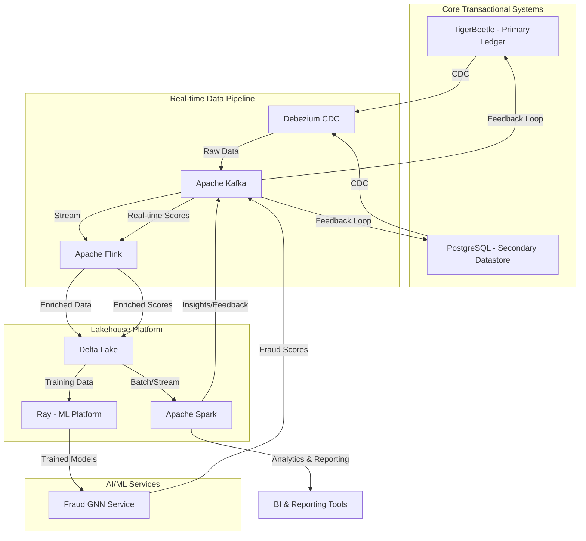

# Bi-Directional Data Flow Architecture

**Date:** 2025-11-03
**Author:** Manus AI

## 1. Introduction

This document outlines the architecture for a comprehensive bi-directional data integration platform that connects the core transactional systems (TigerBeetle, PostgreSQL) with the analytics platform (Lakehouse) and the AI/ML services (Fraud GNN). The primary goal is to create a unified data ecosystem where all analytics flow through the Lakehouse, enabling real-time insights, advanced analytics, and a feedback loop to the operational systems.

## 2. Conceptual Architecture

The following diagram illustrates the high-level architecture of the bi-directional data flow:

## 3. Data Flow Details

### 3.1. TigerBeetle to PostgreSQL Synchronization

*   **Mechanism**: Change Data Capture (CDC) using Debezium.
*   **Process**:
    1.  A Debezium connector for TigerBeetle will be implemented to capture all committed transactions (creates, updates) from the TigerBeetle log.
    2.  The captured changes will be published as events to a dedicated Kafka topic.
    3.  A custom Kafka consumer service (the "CDC Sync Service") will subscribe to this topic and apply the changes to the PostgreSQL database.
*   **Rationale**: This ensures that the PostgreSQL database is a near real-time replica of the TigerBeetle ledger, providing a relational view of the data for services that require it.

### 3.2. PostgreSQL to Lakehouse Streaming Pipeline

*   **Mechanism**: CDC with Debezium and stream processing with Apache Flink.
*   **Process**:
    1.  A Debezium connector for PostgreSQL will capture all changes from the relevant tables (accounts, transactions, etc.).
    2.  These changes will be published to Kafka topics.
    3.  An Apache Flink job will consume these streams, perform any necessary transformations (e.g., joining with other streams, data enrichment), and write the data to Delta Lake tables in the Lakehouse.
*   **Rationale**: This provides a real-time stream of transactional data into the Lakehouse, enabling up-to-the-minute analytics.

### 3.3. Fraud GNN and Lakehouse Integration

*   **Mechanism**: Bi-directional data flow using the Lakehouse as the central hub.
*   **Process**:
    1.  **Training Data**: The Fraud GNN models will be trained using historical data stored in Delta Lake. The Ray platform will be used to scale the training process.
    2.  **Real-time Scoring**: The real-time transaction stream from Kafka will be fed to the Fraud GNN service for scoring.
    3.  **Score Ingestion**: The fraud scores generated by the GNN will be published to a Kafka topic.
    4.  **Score Enrichment**: A Flink job will join the fraud scores with the original transaction stream and write the enriched data to a Delta Lake table.
*   **Rationale**: This creates a closed-loop system where the fraud detection models are continuously improved with new data, and the results are immediately available for analysis.

### 3.4. Lakehouse to Operational Systems Feedback Loop

*   **Mechanism**: Kafka and custom consumer services.
*   **Process**:
    1.  **Insight Generation**: Analytics jobs running on Spark in the Lakehouse will generate insights, such as new fraud patterns, customer segmentation, or risk profiles.
    2.  **Feedback Publication**: These insights will be published to a dedicated Kafka topic.
    3.  **Feedback Consumption**: Custom consumer services will subscribe to this topic and apply the necessary changes to the operational systems:
        *   Update fraud rules in the Fraud Detection service.
        *   Update customer risk profiles in PostgreSQL.
        *   Potentially flag accounts or transactions in TigerBeetle.
*   **Rationale**: This enables the platform to learn from its own data and automatically adapt to new trends and threats.

## 4. Technology Stack

*   **CDC**: Debezium
*   **Streaming**: Apache Kafka, Apache Flink
*   **Storage**: Delta Lake on MinIO
*   **Batch Processing**: Apache Spark
*   **ML Platform**: Ray
*   **Databases**: TigerBeetle, PostgreSQL

This architecture provides a robust, scalable, and real-time data platform that unifies transactional and analytical workloads, enabling the Next-Generation Payment Switch to be a truly data-driven platform.
