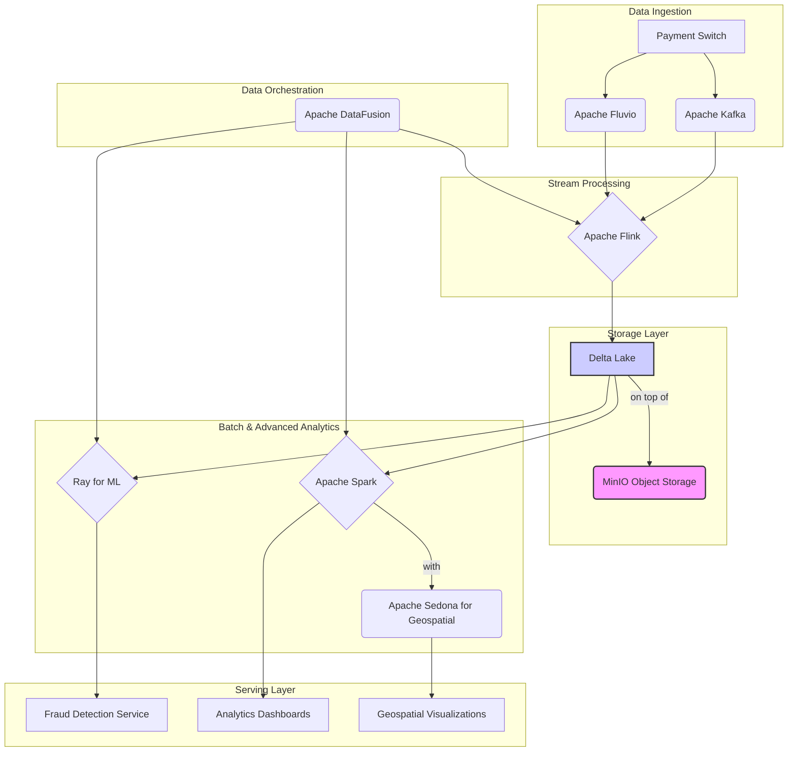

# Next-Generation Payment Switch: Lakehouse Architecture

This document outlines the comprehensive Lakehouse architecture for the Next-Generation Payment Switch, designed for advanced analytics, real-time processing, and machine learning. The architecture integrates Delta Lake, Apache Flink, Apache Spark, Apache DataFusion, Ray, and Apache Sedona to create a powerful and scalable data platform.

## 1. Architecture Overview

The Lakehouse architecture is designed to handle high-volume, real-time transaction data, providing a unified platform for both streaming and batch analytics. The key components and their roles are illustrated in the diagram below.

[Conceptual Diagram of the Lakehouse Architecture]

### Core Components

| Component | Role | Description |
|---|---|---|
| **Data Ingestion** | | |
| Apache Kafka | Real-time Event Streaming | Ingests raw transaction data from the payment switch and other sources. |
| Apache Fluvio | Real-time Data Streaming | Provides an additional layer for real-time data streaming and pre-processing. |
| **Storage** | | |
| MinIO | Object Storage | Scalable and durable object storage for the Lakehouse. |
| Delta Lake | Transactional Data Lake | Provides ACID transactions, schema enforcement, and time travel capabilities on top of MinIO. |
| **Data Processing** | | |
| Apache Flink | Stream Processing | Real-time data processing, enrichment, and aggregation. Reads from Kafka/Fluvio and writes to Delta Lake. |
| Apache Spark | Batch Processing | Large-scale batch processing, data transformation, and machine learning tasks on data in Delta Lake. |
| Apache DataFusion | Data Orchestration | Building and managing data pipelines, integrating with various data sources and sinks. |
| **Advanced Analytics** | | |
| Ray | Distributed Computing | Distributed machine learning model training and serving, leveraging data from the Lakehouse. |
| Apache Sedona | Geospatial Analytics | Large-scale geospatial queries and analytics on location data within the Lakehouse. |
| **Orchestration** | | |
| Kubernetes | Container Orchestration | Deploys and manages all components of the Lakehouse architecture. |

## 2. Data Flow

The data flow through the Lakehouse is as follows:

1.  **Ingestion**: Raw transaction data is ingested in real-time into Apache Kafka and Fluvio.
2.  **Stream Processing**: Apache Flink consumes the data from Kafka/Fluvio, performs real-time processing (e.g., data cleansing, enrichment, aggregation), and writes the processed data to Delta Lake tables.
3.  **Batch Processing**: Apache Spark runs batch jobs on the Delta Lake tables for more complex data transformations, reporting, and machine learning model training.
4.  **Geospatial Analytics**: Apache Sedona is used with Spark to perform geospatial queries and analytics on location data stored in Delta Lake.
5.  **Machine Learning**: Ray is used to train and serve machine learning models using the data in the Lakehouse. The models can be used for fraud detection, customer segmentation, and other use cases.
6.  **Data Orchestration**: Apache DataFusion is used to orchestrate the data pipelines, scheduling and managing the data flow between the different components.

## 3. Kubernetes Deployment

All components of the Lakehouse architecture are deployed on Kubernetes, providing scalability, resilience, and portability. The deployment includes:

*   **Custom Resource Definitions (CRDs)** for each component (Flink, Spark, Ray).
*   **StatefulSets** for stateful components like Kafka and MinIO.
*   **Deployments** for stateless components.
*   **Services** for exposing the different components.
*   **ConfigMaps** and **Secrets** for managing configuration.

This architecture provides a robust and scalable foundation for building advanced data-driven applications for the Next-Generation Payment Switch.



```
```
```
```
```
```
```
```
```
```
```
```
```
```
```
```
```
```
```
```
```
```
```
```
```
```
```
```
```
```
```
```
```
```
```
```
```
```
```
```
```
```
```
```
```
```
```
```
```
```
```
```
```
```
```
```
```
```
```
```
```
```
```
```
```
```
```
```
```
```
```
```
```
```
```
```
```
```
```
```
```
```
```
```
```
```
```
```
```
```\n```\n```\n```
```
```
```
```
```
```
```
```
```
```
```
```
```
```
```
```
```
```
```
```
```
```
```
```
```
```
```
```
```
```
```
```
```
```
```
```
```
```
```
```
```
```
```
```
```
```
```
```
```
```
```
```
```
```
```
```
```
```
```
```
```
```
```
```
```
```
```
```
```
```
```
```
```
```
```
```
```
```
```
```
```
```
```
```
```
```
```
```
```
```
```
```
```
```
```
```
```
```
```
```
```
```
```
```
```
```
```
```
```
```
```
```
```
```
```
```
```
```
```
```
```
```
```
```
```
```
```
```
```
```
```
```
```
```
```
```
```
```
```
```
```
```
```
```
```
```
```
```
```
```
```
```
```
```
```
```
```
```
```
```
```
```
```
```
```
```
```\n```\n```
```
```
```
```
```
```
```
```\n```\n```
```
```\n```
```
```
```
```
```
```
```
```
```
```
```
```
```
```
```
```
```
```
```
```
```
```\n```
```
```
```
```
```
```
```
```
```
```
```
```
```
```
```
```
```
```
```
```
```
```
```
```
