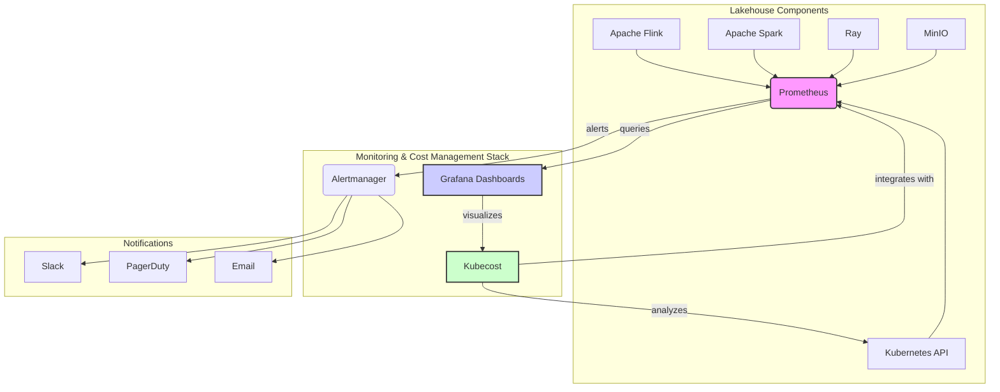

# Lakehouse Monitoring and Cost Management Architecture

This document outlines the comprehensive monitoring and cost management strategy for the Lakehouse components of the Next-Generation Payment Switch. The architecture integrates Prometheus, Grafana, and Kubecost to provide deep visibility into system performance, resource utilization, and cost allocation.

## 1. Architecture Overview

The monitoring and cost management architecture is designed to provide a unified view of the entire Lakehouse stack, from the underlying Kubernetes infrastructure to the individual data processing jobs. The key components and their roles are illustrated in the diagram below.

[Conceptual Diagram of the Monitoring and Cost Management Architecture]

### Core Components

| Component | Role | Description |
|---|---|---|
| **Metrics Collection** | | |
| Prometheus | Time-Series Database | Scrapes and stores metrics from all Lakehouse components, including Flink, Spark, Ray, MinIO, and Kubernetes. |
| **Visualization** | | |
| Grafana | Dashboarding and Visualization | Provides interactive dashboards for visualizing metrics collected by Prometheus. Includes pre-built and custom dashboards for each Lakehouse component. |
| **Cost Management** | | |
| Kubecost | Cost Monitoring and Optimization | Analyzes Kubernetes resource utilization and provides detailed cost breakdowns by namespace, deployment, service, and more. Offers recommendations for cost optimization. |
| **Alerting** | | |
| Alertmanager | Alerting and Notification | Manages alerts generated by Prometheus and routes them to various notification channels, such as Slack, PagerDuty, and email. |

## 2. Data Flow

The monitoring data flow is as follows:

1.  **Metrics Scraping**: Prometheus is configured to automatically discover and scrape metrics from all Lakehouse components using ServiceMonitors and PodMonitors.
2.  **Metrics Storage**: The scraped metrics are stored in Prometheus's time-series database.
3.  **Dashboarding**: Grafana queries the Prometheus database to populate its dashboards, providing real-time visualizations of system performance.
4.  **Cost Analysis**: Kubecost analyzes the resource utilization data from the Kubernetes API server and combines it with cloud provider billing data to provide detailed cost analysis.
5.  **Alerting**: Prometheus evaluates predefined alerting rules and, if triggered, sends alerts to Alertmanager.
6.  **Notifications**: Alertmanager routes the alerts to the configured notification channels.

## 3. Kubernetes Deployment

All monitoring and cost management components are deployed on Kubernetes in a dedicated `monitoring` namespace. The deployment includes:

*   **Prometheus Operator**: Simplifies the deployment and management of Prometheus and its related components.
*   **Grafana Deployment**: Deploys Grafana with pre-configured dashboards and data sources.
*   **Kubecost Deployment**: Deploys the Kubecost agent and server.
*   **Alertmanager StatefulSet**: Deploys a highly available Alertmanager cluster.

This architecture provides a robust and scalable foundation for monitoring and optimizing the cost of the Lakehouse platform.


```
