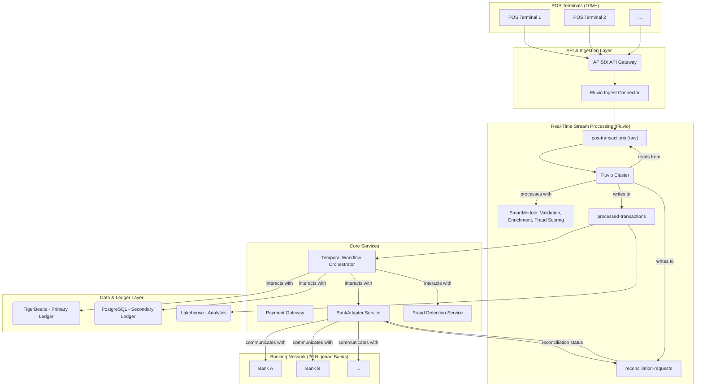

# Real-Time POS Payment Processing Architecture with Fluvio

This document outlines the architecture for a high-throughput, real-time Point-of-Sale (POS) payment processing system designed to handle over 10 million terminals and reconcile transactions across 20 different banks. The architecture leverages Fluvio for real-time stream processing and integrates with the existing Next-Generation Payment Switch components.

## 1. Overview

The primary goal is to build a scalable and resilient system that can process a massive volume of POS transactions in real-time, perform fraud detection, and ensure accurate reconciliation with multiple banking partners. The architecture is designed for low latency, high availability, and data consistency.

## 2. Architecture Diagram

## 3. Component Breakdown

### 3.1. POS Terminals
Over 10 million POS terminals will connect to the platform via a secure API endpoint. Each terminal will be authenticated and authorized before processing transactions.

### 3.2. API & Ingestion Layer
*   **APISIX API Gateway**: Serves as the primary entry point for all POS transaction requests. It handles authentication, rate limiting, and request routing.
*   **Fluvio Ingest Connector**: A high-performance connector that receives transaction data from APISIX and ingests it into the `pos-transactions` Fluvio topic.

### 3.3. Real-Time Stream Processing (Fluvio)
*   **Fluvio Cluster**: A scalable, distributed streaming platform that forms the core of the real-time processing engine.
*   **`pos-transactions` Topic**: A Fluvio topic that stores raw, unprocessed transaction data from the POS terminals.
*   **SmartModule**: A WebAssembly-based stream processing function that performs:
    *   **Validation**: Checks for data integrity and format correctness.
    *   **Enrichment**: Adds metadata such as terminal location, merchant ID, and timestamp.
    *   **Fraud Scoring**: Applies a real-time fraud detection model to each transaction.
*   **`processed-transactions` Topic**: A topic containing validated, enriched, and scored transactions, ready for further processing.
*   **`reconciliation-requests` Topic**: A topic for managing reconciliation requests and responses with the `BankAdapter`.

### 3.4. Core Services
*   **Payment Gateway**: Handles the initial reception of transaction data and passes it to the Fluvio ingest connector.
*   **Temporal Workflow Orchestrator**: Subscribes to the `processed-transactions` topic and orchestrates the end-to-end payment workflow for each transaction.
*   **BankAdapter Service**: A new service responsible for communicating with the 20 different Nigerian banks. It abstracts the complexities of each bank's API into a standardized interface.
*   **Fraud Detection Service**: Provides the fraud detection models and rules used by the Fluvio SmartModule.

### 3.5. Data & Ledger Layer
*   **TigerBeetle**: The primary, high-performance accounting database for recording all financial transactions as a source of truth.
*   **PostgreSQL**: The secondary ledger for storing transaction history, customer data, and other relational information.
*   **Lakehouse**: The analytics platform where processed transactions are stored for business intelligence, reporting, and advanced analytics.

### 3.6. Banking Network
This represents the 20 Nigerian banks that the platform integrates with for payment settlement and reconciliation.

## 4. Data Flow

1.  A POS terminal sends a payment request to the APISIX API Gateway.
2.  APISIX authenticates the request and forwards it to the Fluvio Ingest Connector.
3.  The connector ingests the raw transaction data into the `pos-transactions` Fluvio topic.
4.  The Fluvio cluster processes the raw transaction using the SmartModule for validation, enrichment, and fraud scoring.
5.  The processed transaction is published to the `processed-transactions` topic.
6.  The Temporal Workflow Orchestrator consumes the processed transaction and starts a new payment workflow.
7.  The workflow interacts with:
    *   **TigerBeetle** to create and manage the financial transaction.
    *   The **BankAdapter** to initiate the inter-bank transfer.
    *   **PostgreSQL** to log the transaction history.
8.  The `BankAdapter` communicates with the respective bank's API to settle the payment.
9.  Reconciliation status is communicated back via the `reconciliation-requests` topic.
10. Processed transactions are also streamed to the Lakehouse for analytics.

## 5. Key Design Considerations

*   **Scalability**: All components are designed to be horizontally scalable to handle the massive transaction volume.
*   **Low Latency**: Fluvio's high-performance stream processing ensures that transactions are processed with minimal delay.
*   **High Availability**: The platform is deployed in a multi-region, active-active configuration to ensure continuous operation.
*   **Data Consistency**: TigerBeetle provides strong consistency guarantees for all financial transactions.
*   **Modularity**: The `BankAdapter` service is designed to be easily extensible to support new banks.

This architecture provides a robust and scalable foundation for a modern, real-time POS payment processing system.
