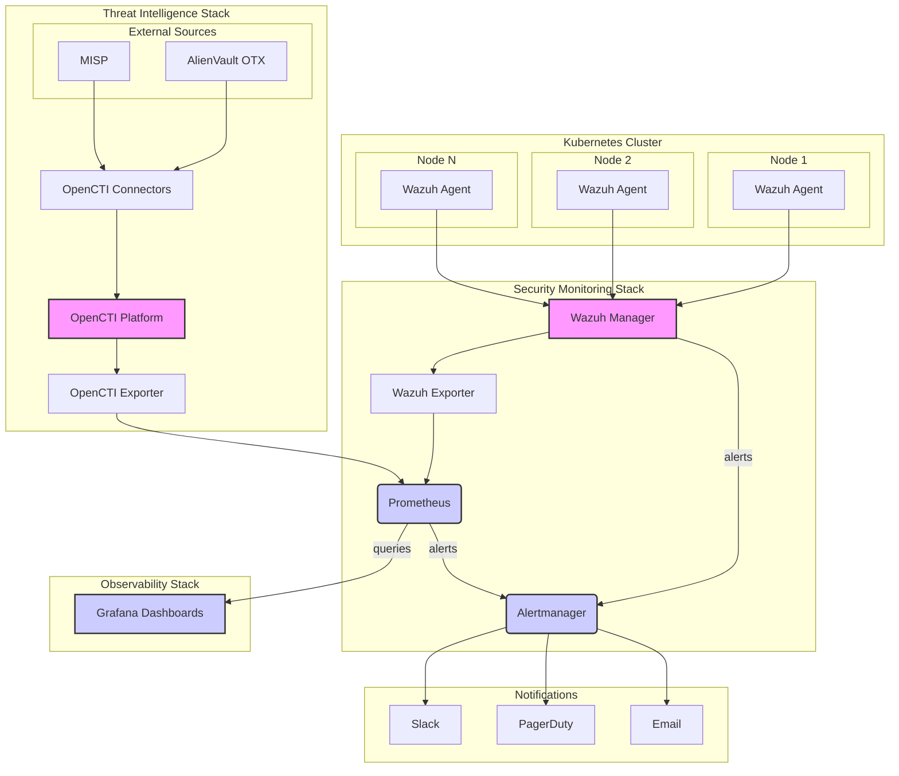

# Integrated Security Monitoring Architecture

This document outlines the architecture for integrating Wazuh (SIEM and security monitoring) and OpenCTI (threat intelligence) into the existing Prometheus/Grafana/Alertmanager stack. This creates a unified security and observability platform for the Next-Generation Payment Switch.

## 1. Architecture Overview

The integrated architecture combines the strengths of each tool to provide a comprehensive security posture:

*   **Wazuh**: Provides real-time security monitoring, log analysis, file integrity monitoring, and vulnerability detection.
*   **OpenCTI**: Centralizes, organizes, and shares threat intelligence information.
*   **Prometheus**: Collects metrics from all components, including security-related metrics from Wazuh and OpenCTI.
*   **Grafana**: Visualizes both performance and security metrics in unified dashboards.
*   **Alertmanager**: Manages and routes security alerts generated by both Wazuh and Prometheus.

[Conceptual Diagram of the Integrated Security Monitoring Architecture]

### Core Components

| Component | Role | Description |
|---|---|---|
| **Security Monitoring** | | |
| Wazuh Manager | SIEM and Log Analysis | Collects and analyzes security data from Wazuh agents deployed across the infrastructure. |
| Wazuh Agent | Data Collection | Deployed as a DaemonSet on each Kubernetes node to collect logs, file integrity data, and security events. |
| **Threat Intelligence** | | |
| OpenCTI Platform | Threat Intelligence Management | Centralizes and correlates threat intelligence from various sources. |
| OpenCTI Connectors | Data Import | Imports threat intelligence data from external sources (e.g., MISP, AlienVault OTX). |
| **Integration Layer** | | |
| Wazuh Exporter | Metrics Export | Exposes Wazuh alerts and statistics as Prometheus metrics. |
| OpenCTI Exporter | Metrics Export | Exposes OpenCTI metrics, such as the number of indicators and observables. |
| **Monitoring Stack** | | |
| Prometheus | Metrics Collection | Scrapes metrics from Wazuh Exporter, OpenCTI Exporter, and other components. |
| Grafana | Unified Dashboarding | Visualizes security and performance metrics in a single pane of glass. |
| Alertmanager | Alert Routing | Routes security alerts from Wazuh and Prometheus to notification channels. |

## 2. Data Flow

1.  **Security Data Collection**: Wazuh agents on each node collect security data and forward it to the Wazuh Manager.
2.  **Threat Intelligence Ingestion**: OpenCTI connectors import threat intelligence data into the OpenCTI platform.
3.  **Alert Generation**: The Wazuh Manager analyzes the collected data and generates security alerts.
4.  **Metrics Exposure**: The Wazuh Exporter and OpenCTI Exporter expose security metrics to Prometheus.
5.  **Metrics Scraping**: Prometheus scrapes the security metrics.
6.  **Dashboarding**: Grafana queries Prometheus to populate the security dashboards.
7.  **Alert Routing**: Wazuh alerts are forwarded to Alertmanager, which then routes them to the appropriate notification channels.

## 3. Kubernetes Deployment

*   **Wazuh**: Deployed as a StatefulSet for the manager and a DaemonSet for the agents.
*   **OpenCTI**: Deployed as a set of Deployments for the platform, workers, and connectors.
*   **Exporters**: Deployed as Deployments alongside their respective applications.

This integrated architecture provides a powerful and scalable solution for proactive security monitoring and threat intelligence management.

